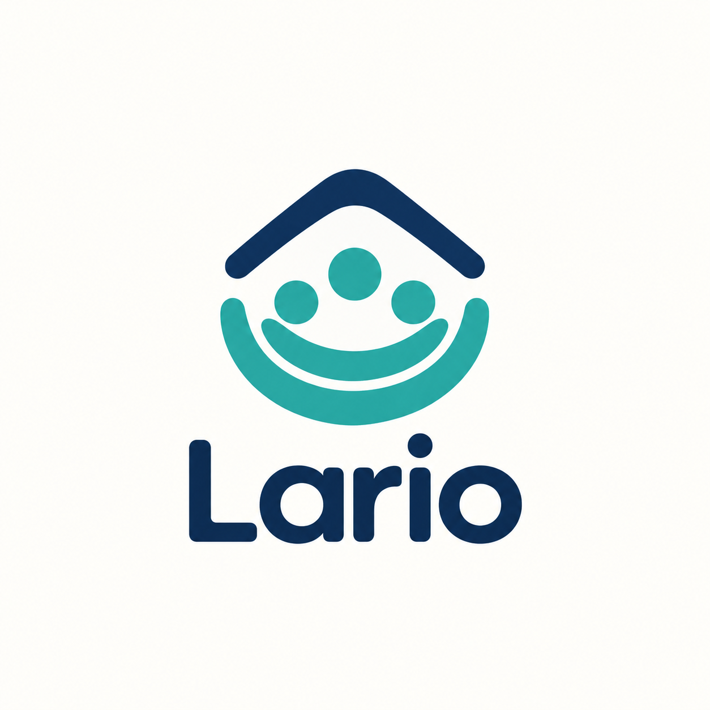

# Lario

**Lario** ist eine lokale Finanzplanungsanwendung mit unabhängiger mobiler Offline-Ausgabenerfassung.

## Planung

- [Fachliches Entwicklungskonzept](docs/Finanzplanung_Entwicklungskonzept.md)
- [Architektur und Umsetzungsplan](docs/Finanzplanung_Architektur_und_Umsetzungsplan.md)
- [Geprüfter Implementierungsplan](docs/Finanzplanung_Implementierungsplan.md)

Die Entwicklung beginnt als Greenfield-Projekt. Die Schritte und Abnahmekriterien stehen im Implementierungsplan; bei Abweichungen gelten dessen dokumentierte aktuelle Entscheidungen.

## Technologien

- Linux: C#/.NET und ASP.NET Core, EF Core, SQLite
- Hauptoberfläche: Angular
- Android: Angular/Capacitor mit eigener SQLite-Datenbank und späterer Synchronisation im Heimnetz

## Branding

Der aktuelle [Logoentwurf](assets/branding/lario-logo.png) zeigt ein Nest mit drei Familienpunkten unter einem schützenden Dachbogen in Dunkelblau und Türkis. Der Name verbindet den persönlichen Bezug zu Mario mit der Idee eines Haushüters (Lar).

Das Bild enthält Symbol und Schriftzug; eine separate App-Icon-Datei ist noch abzuleiten. Hinweise und der frühere Entwurf stehen unter [assets/branding](assets/branding/README.md).

## Entwicklungsstand

Dieses Repository enthält zunächst die Planungsgrundlage und den Logoentwurf. Die Anwendung wird maßgeschneidert für den eigenen Haushalt entwickelt. Ein späterer Vertrieb ist eine Option, keine Voraussetzung für die Entwicklung.
