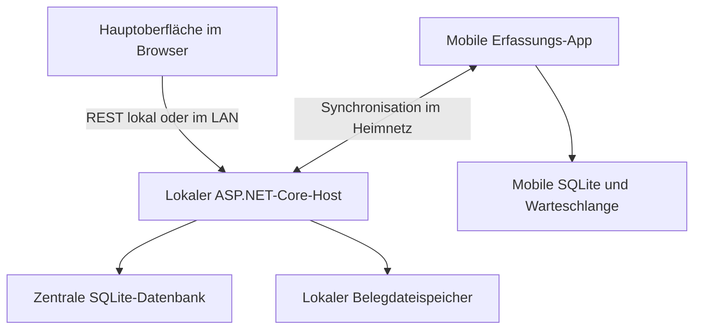

# MoneyMap – Architektur und Umsetzungsplan

**Festgelegter Name:** MoneyMap. **Kurzform:** MMap. Anwendung, Repository, .NET-Solution und Namespace verwenden `MoneyMap`. Der bisherige Projektname GSpend wird für die Neuentwicklung nicht weiterverwendet.

Stand: 8. Oktober 2026. Ergänzung zu Finanzplanung_Entwicklungskonzept.md. Technischer Vorschlag für die Umsetzung durch einen Entwickler oder ein lokales Coding-LLM. Verbindliche Entscheidung: Greenfield-Neuentwicklung ohne Altdatenmigration. Die frühere Python-Anwendung enthält keine Nutzdaten.

## 1. Entscheidung

Empfohlen wird ein modular aufgebauter lokaler Monolith mit C#/.NET 10, ASP.NET Core, EF Core und SQLite. Die vollständige Hauptoberfläche läuft als Angular-Anwendung im Browser. Eine reduzierte mobile Angular-Anwendung wird mit Capacitor als installierbare App ausgeliefert und nutzt eine eigene SQLite-Datenbank. Gemeinsame Eingabekomponenten und Datenverträge werden geteilt; die mobile App benötigt unterwegs keinen Server.

Linux ist die verbindliche primäre Zielplattform der Hauptanwendung. Windows-Unterstützung ist optional. Verwendet wird .NET 10 mit ASP.NET Core, ausdrücklich kein Windows-only .NET Framework. Die konkrete Linux-Distribution wird auf dem Zielrechner getestet.

Die frühere Python-Anwendung enthält keine Nutzdaten und dient höchstens als Bedienreferenz. Backend, Oberfläche, Datenmodell und Synchronisierung werden neu implementiert. Kein Import und keine Kompatibilität zum bisherigen Schema sind erforderlich.

Android ist als erste mobile Zielplattform bestätigt. Planungszeiträume bleiben feste Kalendermonate. Gehalt am Monatsende finanziert standardmäßig den Folgemonat; ein abweichendes Eingangsdatum verschiebt nicht den Budgetanfang.

| Aufgabe | Technologie | Begründung der Auswahl |
|---|---|---|
| Fachlogik | C# auf .NET 10 LTS | Passt zum vorhandenen .NET-Hintergrund; zentrale, testbare Berechnungen |
| Lokaler Host/API | ASP.NET Core 10, REST/JSON | Ein Prozess liefert Oberfläche, Finanzlogik und Synchronisation |
| Zentrale Datenhaltung | EF Core 10 mit SQLite | Für private Finanzdaten und einen zentralen schreibenden Host ausreichend; kein separater DB-Dienst |
| Hauptoberfläche | Angular 22 und TypeScript | Browseroberfläche für lokale Nutzung und LAN; Komponenten mit Mobiloberfläche teilbar |
| Mobile App | Angular und Capacitor 8 | Weboberfläche wird in die installierte App eingebettet, nicht vom Heimserver geladen |
| Mobiler Speicher | SQLite über @capacitor-community/sqlite | Dauerhafte relationale Speicherung für Eingaben, Stammdaten und Synchronisationswarteschlange |
| API-Vertrag | OpenAPI und generierter TypeScript-Client | Verhindert auseinanderlaufende DTOs zwischen .NET und Mobil/Web |
| Verifikation | xUnit, API/SQLite-Integrationstests, UI-Tests und reales Mobilgerät | Schwerpunkt auf Finanzregeln, Wiederholung der Synchronisation und Offline-Betrieb |

Versionen in Lockfiles/global.json festhalten und kompatible aktuelle Patchstände verwenden. Capacitor und SQLite-Plugin vor Festschreibung gemeinsam auf einem echten Gerät testen. Das SQLite-Plugin ist eine Community-Abhängigkeit und wird hinter einem kleinen Speicherinterface gekapselt. Angular-Komponenten bevorzugt mit Standardmitteln und CSS erstellen; zusätzliche UI-Frameworks erst bei konkretem Bedarf.

.NET 10 ist laut Microsoft bis 14. November 2028 unterstützt. Angular 22 ist laut Angular aktuell aktiv unterstützt. Capacitor dokumentiert das Einbetten des gebauten Webbundles in native Projekte. Das ist die technische Grundlage für eine vom Hauptprogramm unabhängige App; dauerhafte Datenhaltung und Synchronisation müssen zusätzlich implementiert werden.

## 2. Betriebsarchitektur

Der Host liefert auch die statischen Angular-Dateien. Auf dem Hauptrechner reicht eine Startaktion: Host starten und Browser öffnen. Alternativ läuft derselbe Host als lokaler Dienst auf einem ständig verfügbaren Heimrechner. Ein solcher Dauerbetrieb ist keine Voraussetzung: Ist der Host ausgeschaltet, arbeitet die mobile App weiter und wartet mit der Synchronisation.

Die zentrale SQLite-Datei liegt auf dem lokalen Datenträger des Hosts. LAN-Clients greifen über die API zu, nicht direkt auf eine freigegebene Datenbankdatei. Die Mobilgeräte teilen keine Datenbankdatei mit dem Host, sondern tauschen fachliche Datensätze und Änderungen aus.

Der mobile Produktionsbuild enthält seine Oberfläche und Ressourcen vollständig. Keine server.url zum Laden der Hauptoberfläche im Produktionsbuild. Nach Einrichtung und Stammdatensynchronisation muss die App im Flugmodus und nach Neustart starten und Ausgaben speichern können.

## 3. Fachliche Module und Projektstruktur

Vier .NET-Projekte reichen als Ausgangspunkt:

| Projekt | Zuständigkeit |
|---|---|
| MoneyMap.Domain | Geldbeträge, Buchungsregeln, Reservierungsregeln, Zeiträume und Invarianten; unabhängig von HTTP und Datenbank |
| MoneyMap.Application | Anwendungsfälle wie Ausgabe buchen, Transfer bestätigen, Vorhaben abschließen und Monatsübersicht berechnen |
| MoneyMap.Infrastructure | EF Core/SQLite, Migrationen, Backups, Geräteverwaltung und Synchronisationsspeicherung |
| MoneyMap.Host | API, Authentifizierung, statische Oberfläche, Konfiguration und Programmstart |

Domain hat keine Abhängigkeit auf Infrastructure. Application nutzt Domain und gezielte Schnittstellen. Infrastructure implementiert diese Schnittstellen. Host verbindet die Komponenten. Keine generische Repository-Schicht um jede EF-Tabelle; Datenzugriffe folgen den tatsächlichen Anwendungsfällen.

Fachliche Module innerhalb dieser Struktur: Stammdaten, Buchungsjournal, Planung, Vorhaben, Steuerauswertung, Belegablage, Auswertungen, Synchronisation und Sicherung. Der Wohnungsbereich ist eine eigene Ansicht auf dieselben Buchungs- und Planungsregeln; keine zweite unabhängig rechnende Finanzengine.

Frontend als schlanker gemeinsamer Workspace: Haupt-Webapp, mobile App sowie gemeinsame Bibliotheken für DTOs/API-Client, Ausgabeformular, Formatierung und einfache Eingabevalidierung. Vollständige Planung und Saldenlogik bleiben im C#-Kern. Die Mobilapp benötigt nur Erfassungsregeln und optional eine ausdrücklich vorläufige lokale Fortschreibung.

## 4. Datenmodell als Ausgangspunkt

| Entität | Kerninhalt |
|---|---|
| Account | Konto, Anfangsbestand, Archivstatus |
| Fund | Geldpool wie Flex, Freizeit oder Rücklage |
| Category | Einnahme-/Ausgabenkategorie mit optionaler Oberkategorie und steuerlichen Voreinstellungen |
| TaxCategory | Unabhängige Steuerkategorie mit Oberkategorie/Archivstatus |
| TaxAnnotation | Relevanz, markierter Teilbetrag, Steuerkategorie und Notiz am Split |
| Attachment / AttachmentLink | Originaldatei-Metadaten, Prüfsumme, Speicher-ID und Ausgabe-/Split-Zuordnung |
| Transaction | ID, Typ, Buchungsdatum, optionaler Finanzierungsmonat für Einnahmen, Notiz, Herkunft, Revision, Korrektur-/Stornobezug |
| AccountPosting | Tatsächlicher Kontozu- oder -abgang einer Transaktion |
| FundPosting | Zuweisung, Verbrauch oder Umwidmung eines Pools |
| ExpenseSplit | Teilbetrag, Kategorie, Pool, optionales Vorhaben und Richtwertzuordnung |
| FundLocation / Settlement | Nachvollziehbare Kontoverteilung und offene interne Ausgleiche |
| RecurringRule / RuleVersion | Wiederkehrende Einnahmen, Ausgaben oder Transfers mit Gültigkeit ab Datum |
| PlannedOccurrence | Erwarteter einzelner Vorgang, Fälligkeit, Deckung und verknüpfte tatsächliche Buchung |
| MonthlyGuideline | Monatlicher Richtwert und zeitliche Versionen |
| Project / ReservationMovement | Vorhaben und Änderungen seiner Reservierung |
| Device / SyncOperation / ChangeLog | Geräte, verarbeitete Operationen, Revisionen und serverseitige Änderungscursor |

Nicht jeder UI-Vorgang ist eine Geldbewegung. Eine Reservierung, die Bestätigung einer Überweisung und eine tatsächliche Ausgabe haben unterschiedliche Wirkungen. Reservierungsbewegungen werden nicht als Kontobuchungen gespeichert.

Empfohlen wird ein nachvollziehbares Buchungsjournal mit atomaren, miteinander verknüpften Konto- und Poolbewegungen. Kontostände und Poolbestände werden daraus berechnet; optionale gecachte Übersichten müssen aus den Grunddaten wiederherstellbar sein. Änderungen an bestätigten Buchungen werden durch verknüpfte Korrekturen/Stornos nachvollziehbar gemacht. Das ist keine vollständige steuerliche doppelte Buchführung und kein verteiltes Event-Sourcing-System.

FundLocation/Settlement bildet eine signierte Konto-Pool-Zuordnung mit expliziten Ausgleichspositionen ab: Wird ein Geschenk aus Freizeit vom Hauptkonto bezahlt, sinkt der Freizeitpool sofort. Der noch nicht zurücküberwiesene Betrag wird als offener interner Ausgleich sichtbar. Er darf am ursprünglichen Konto nicht zugleich als frei verfügbares Freizeitgeld gelten. Der tatsächliche Zahlungskontostand sinkt bei der Ausgabe; die anderen Kontostände ändern sich erst bei der Überweisung. Negative Konto-Pool-Zuordnungen bilden Vorfinanzierung ab. Summen je Konto entsprechen realen Kontoständen, Summen je Pool dessen Bestand. Global freie Mittel und kontobezogene Liquidität bleiben getrennt. Die Referenzzahlen stehen im Implementierungsplan. Dieser Fall ist Bestandteil der ersten Domänentests.

## 5. Beträge, Termine und Verpflichtungen

Für Geldbeträge wird ein Money-Wertobjekt mit ganzzahligen Centbeträgen und Währung verwendet. Speicherung als SQLite INTEGER; .NET long und im TypeScript-Client validierte sichere Ganzzahlen innerhalb einer festgelegten Grenze. Geld wird niemals mit float/double gerechnet. Prozent- und Zinsberechnungen erfolgen in C# decimal mit expliziter Rundung auf Cent.

Der EF-Core-SQLite-Provider hat Einschränkungen bei decimal-Abfragen und datenbankgenerierten Concurrency-Tokens. Centbeträge und anwendungsverwaltete Revisionen vermeiden diese Abhängigkeiten.

Buchungsdatum als fachliches Datum, technische Änderungszeitpunkte in UTC. Wiederkehrende Regeln verwenden lokale Kalendermonate in Europe/Berlin, nicht pauschal 30 Tage. Fälligkeitstag 31 in kurzen Monaten wird auf den letzten Monatstag gelegt. Ansparungen mit Restcent werden nach einer festen Regel verteilt, sodass die Summe exakt bleibt.

Noch offene Verpflichtungen reduzieren die freien Mittel einmal. Beim Bezahlen wird die Planbindung durch die echte Ausgabe ersetzt. Bei einem Jahreskostenpool wurde das Geld bereits umgewidmet und darf nicht nochmals Flex reduzieren. Erwartetes Einkommen erhöht nur die Vorschau, tatsächlich gebuchtes Einkommen den Bestand. Jede PlannedOccurrence darf höchstens einer wirksamen Erfüllungsbuchung zugeordnet sein.

Gebunden werden offene vergangene Vorgänge, der laufende Monat und ausdrücklich finanzierte zukünftige Monate. Weitere Vorschau erzeugt keine pauschalen Bindungen. Gehalt am Monatsende finanziert den Folgemonat, ohne Kalendergrenzen zu verschieben oder den gesamten Eingang automatisch zu sperren. Stornos, echte Erstattungen und Kontostandskorrekturen sind eigene Anwendungsfälle.

## 6. Offline-Erfassung und Synchronisation

Mobile Daten: benötigte Stammdaten einschließlich Steuerkategorien/Voreinstellungen, eigene Ausgaben einschließlich Steuerkennzeichnung, deren Versionen, Gerätekonfiguration, letzter Cursor und eine Outbox. Ein vollständiger Bestand aller historischen Finanzdaten ist für den mobilen Mindestumfang nicht nötig.

Speicherablauf: Beim Speichern werden Ausgabe und Outbox-Eintrag in derselben lokalen SQLite-Transaktion geschrieben. Die Bestätigung in der Oberfläche erfolgt erst danach. IDs werden bereits auf dem Gerät erzeugt, zum Beispiel als UUID. Für Änderungen werden Operations-ID und erwartete Basisrevision gespeichert.

Synchronisation wird zunächst explizit per Schaltfläche gestartet. Automatik bei geöffneter App und erreichbarem Host kann später hinzukommen. Dauerhafte Hintergrundausführung auf dem Handy ist keine Voraussetzung.

1. Verbindung und Protokollversion prüfen; Änderungen und Stammdaten seit dem letzten Cursor abrufen. Beim ersten Verbinden einen konsistenten Snapshot mit zugehörigem Cursor laden.
2. Offene Operationen in ihrer lokalen Reihenfolge an den Host senden. Lokale Entwürfe dabei nicht durch den heruntergeladenen Stand überschreiben.
3. Host prüft IDs, Stammdatenbezüge, Beträge und Basisrevision. Buchung, Ausgleiche, ChangeLog und Idempotenznachweis werden gemeinsam in einer DB-Transaktion gespeichert.
4. Host liefert pro Operation angenommen, bereits verarbeitet oder Konflikt/Validierungsfehler. Nur explizit bestätigte Operationen werden lokal quittiert.
5. Neue serverseitige Änderungen nachladen und lokal atomar übernehmen. Cursor erst nach erfolgreicher Speicherung fortschreiben.

Jede Operation besitzt eine global eindeutige ID und einen Payload-Nachweis. Wiederholung derselben ID mit identischem Inhalt liefert dieselbe Bestätigung; dieselbe ID mit anderem Inhalt ist ein Fehler. Unique Constraints sichern diese Regel auch bei konkurrierenden Requests.

Korrekturen setzen die erwartete Basisrevision voraus. Änderungen derselben Ausgabe an beiden Geräten erzeugen einen sichtbaren Konflikt; keine pauschale Last-write-wins-Regel. Archivierte Kategorien bleiben für historische/offline erfasste Vorgänge referenzierbar. Löschungen/Stornos werden im Änderungsstrom übertragen. Veraltete Protokolle werden erkennbar abgewiesen; lokale Eingaben bleiben erhalten.

API-Ausgangspunkt: /api/v1/expenses, /transactions, /accounts, /funds, /categories, /tax-categories, /planning, /projects, /attachments und /reports einschließlich Steuerauswertung; /sync/bootstrap, /sync/changes sowie /sync/push für die mobile Schnittstelle. Es werden Datensätze synchronisiert, keine SQLite-Dateien kopiert.

## 7. Zugriff im lokalen Netzwerk

Standardbetrieb auf localhost. Für mobile Synchronisation wird der LAN-Zugriff explizit eingerichtet. Die App koppelt sich einmal mit dem Host, beispielsweise über einen QR-Code mit Adresse, einmaligem Kopplungscode und Vertrauensinformation. Anschließend nutzt sie widerrufbare Gerätezugangsdaten.

HTTPS und die Zertifikats-/Vertrauenskonfiguration sind Teil des frühen Netzwerkprototyps. HTTPS-Zugriffe müssen das lokale Hostzertifikat zuverlässig validieren können. Ein nativer HTTP-Client mit TLS und gezielt eingerichtetem Vertrauensanker ist eine Implementierungsoption; Zertifikatsprüfung nicht global abschalten. Bei Verwendung der WebView-Netzwerkschnittstelle deren Ursprungs- und CORS-Regeln explizit konfigurieren. Adresse/Hostname müssen zur Vertrauenskonfiguration passen. Zugangsdaten in einem nativen sicheren Speicher aufbewahren.

Auch Desktopzugriff und sensible Änderungsendpunkte werden lokal authentifiziert. Keine öffentliche Freigabe oder Portweiterleitung erforderlich. Für Entwicklung nur lokale Testdaten und explizite Entwicklungsnetzkonfiguration verwenden.

## 8. Sicherung und spätere Schemaänderungen

SQLite-Datei auf dem lokalen Rechner; Backup über SQLite-Backup-Funktion beziehungsweise kontrollierten konsistenten Snapshot, nicht unkoordiniertes Kopieren einer geöffneten Datei samt ignorierter WAL-Datei. Sicherung enthält Datenbank, alle referenzierten Originalbelege als zusammengehörigen Stand, Schema-/Appversion und Wiederherstellungsinformationen. Backupziel auf anderem Datenträger konfigurierbar. Wiederherstellung mit realen Testdaten nachweisen.

Eine Altdatenmigration ist nicht erforderlich. Neue Installationen starten mit manuell erfassten Anfangsbeständen und deren Poolzuordnung. Zukünftige Datenbankschemaänderungen werden versioniert und vor Anwendung gesichert. Ein Restore erzeugt eine neue Synchronisationsgeneration, damit Geräte den zurückgesetzten Änderungsstand erkennen.

Noch nicht synchronisierte mobile Eingaben existieren nur auf dem Gerät. Für sie wird ein Export-/Rettungsweg vorgesehen; ein Serverbackup schützt diese Eingaben erst nach der Synchronisation.

## 9. Entwicklung in überprüfbaren Etappen

| Phase | Lieferumfang | Abnahmekriterium |
|---|---|---|
| 0 – Regeln festlegen | Greenfield-Grundlage, Buchungsmodell und Referenzfälle dokumentieren | Kernfälle sind fachlich eindeutig |
| 1 – Technische Machbarkeit | Host, kleines Angular-Formular, Android-App, mobile SQLite, LAN-Verbindung | Im Flugmodus Ausgabe speichern, App neu starten, später genau einmal übertragen |
| 2 – Finanzkern | Konten, Pools, Splits, Journal, interne Ausgleiche, Reservierungen | Kernbeispiele stimmen bis auf den Cent; Transfer verursacht keine zweite Ausgabe |
| 3 – Alltag | Mobile Erfassung, Korrekturen, Steuerkennzeichnung, Syncstatus; Desktop-Eingabe und PDF-/Bildanhänge | Gemischter Einkauf offline erfassbar; vorhandene Nachweise am Desktop zuordenbar |
| 4 – Planung | Einnahmen, Verpflichtungen, Ansparungen, Regeln ab Datum, Monatsvorschau | Plan/Bestätigung ohne Doppelzählung; Monatswechsel übernimmt Rest |
| 5 – Wohnung, Vorhaben und Steueransicht | Detailansichten, Transferänderungen, Abschluss/Freigabe, Steuerkategorien und Nachweisexport | Wohnungs-/Vorhabenbeispiele stimmen; relevante Teilbeträge und Originalbelege korrekt auswertbar |
| 6 – Betrieb | Backup/Restore, Linux-/Android-Installation und Konfliktbehandlung | Rücksicherung und Syncabbrüche getestet; keine Altdatenmigration |

Offline-Erfassung und Sync werden in Phase 1 früh erprobt, nicht erst an eine fertige Desktopanwendung angehängt. Ab Phase 2 werden Funktionen jeweils mit ihren tatsächlich benötigten Synchronisationsdaten umgesetzt.

Diese Phasen sind nur eine Übersicht. Verbindlich ist die detaillierte Reihenfolge mit 20 Abschnitten (Schritte 0–18 einschließlich 7a) im Implementierungsplan.

Für das Coding-LLM pro Etappe einen abgegrenzten Auftrag geben: Ziel, betroffene Komponenten, erlaubte Schemaänderungen, Beispieldaten und Abnahmekriterien. Nach jeder Etappe lauffähigen Stand und Migrationen sichern. Erst nach bestandenem Kernbeispiel die nächste fachliche Funktion hinzufügen.

## 10. Zentrale Tests

Zusätzliche Abnahmen: steuerliche Teilbeträge ohne Saldenwirkung, vererbte Voreinstellung mit Ausnahme, Steuerkategoriebaum ohne Doppelzählung, PDF/Bild nach Neustart, Paketexport mit Belegzuordnung und konsistente Wiederherstellung der Dateien.

Finanztests aus dem Fachkonzept, insbesondere 85 € Split-Einkauf, 20 € Ausgleich ohne erneuten Abzug, Reservierung/Abschluss, erwartete Einnahmen, Jahreskosten und Wohnungstransfers. Ergänzend: Ausgaben korrigieren, Überschreitung einer Reservierung, Kostenänderung ab Datum und genaues Verteilen von Restcent.

Synchronisationstests mit realen SQLite-Datenbanken: mehrfaches Senden, Abbruch nach serverseitigem Commit vor Antwort, konfliktierende Revisionen, Stornoübertragung, archivierte Kategorie und Appneustart mit offener Outbox. Tests mit SQLite selbst, nicht nur einem In-Memory-Ersatzprovider. Offline-Speicherung und LAN-Vertrauen außerdem auf einem echten Androidgerät prüfen.

## 11. Abwägungen

Eine native mobile Erfassungs-App benötigt einen eigenen Build und gelegentliche Appupdates. Dafür ist ihre Oberfläche unabhängig vom Heimserver installierbar und die lokale Erfassung klar kontrollierbar. Eine PWA wäre eine Alternative, würde aber Installation, sicheren Ursprung und dauerhafte Browserdatenhaltung zusätzlich zum lokalen Serverbetrieb erfordern. Für diesen Anwendungsfall wird daher Capacitor empfohlen.

Eine native .NET-Desktopoberfläche wäre möglich, würde aber die Wiederverwendung der Eingabeoberfläche mit dem hier gewählten mobilen Webstack reduzieren. Der Browser als Hauptoberfläche vermeidet eine zusätzliche Desktop-UI. Für das Greenfield-Projekt ist Angular im Browser als Hauptoberfläche festgelegt.

Die wesentliche technische Schwierigkeit liegt in korrekter Geldzuordnung und verlässlicher Synchronisation. Ein einzelner lokaler Host mit klaren Modulen reicht dafür aus. Keine zusätzlichen Microservices, Message-Broker oder LLM-Laufzeit im Finanzprogramm erforderlich.

## 12. Verifizierte technische Grundlagen

- [.NET-Supportpolitik](https://dotnet.microsoft.com/en-us/platform/support/policy/dotnet-core): .NET 10 LTS und Supportlaufzeit.
- [Angular-Versionen](https://angular.dev/reference/releases): Angular 22 im aktiven Support.
- [Capacitor](https://capacitorjs.com/docs): Native Laufzeit für Webanwendungen.
- [Capacitor-Buildablauf](https://capacitorjs.com/docs/basics/workflow): Gebautes Webbundle wird ins native Projekt kopiert.
- [SQLite-Plugin](https://github.com/capacitor-community/sqlite): Nativer SQLite-Speicher für Capacitor.
- [EF-Core-SQLite-Einschränkungen](https://learn.microsoft.com/en-us/ef/core/providers/sqlite/limitations): Datentypen, Concurrency-Tokens und Migrationen.

Die genannten Architekturschritte und Produktentscheidungen sind Empfehlungen für dieses Projekt; die Quellen dokumentieren die zugrunde liegenden Plattformfunktionen. Das Repository wird neu angelegt; kompatible Patchstände werden im Prototyp geprüft. Der verbindliche Arbeitsplan und die Review-Ergänzungen stehen in Finanzplanung_Implementierungsplan.md.

## 13. Steuerkennzeichnung und Belegspeicher

Steuerkategorien sind eigene Stammdaten mit Unterkategorien. Category-Voreinstellungen sind vererbbar und durch explizite Werte am Posten übersteuerbar. Eine TaxAnnotation wird beim Erfassen als wirksamer Wert am Split gespeichert, damit spätere Stammdatenänderungen die Vergangenheit nicht verändern. Der relevante Teilbetrag ist maximal der Splitbetrag. Steuerkennzeichnung ist unabhängig von der normalen Buchungs-/Poollogik und mobil synchronisierbar.

Auswertungen gruppieren tatsächlich gezahlte Teilbeträge nach Zahlungsjahr und Steuerkategorie, zeigen relevante Posten ohne Kategorie sowie fehlende Nachweise und liefern CSV plus ZIP-Belegpaket mit Zuordnungsliste. Erstattungen bleiben mit dem Ursprung verknüpft und werden separat ausgewiesen. Es gibt keine automatische verbindliche Steuer-/Abzugsfähigkeitsberechnung.

PDF-/JPEG-/PNG-Originaldateien werden bereits im Grundumfang als lokale Hostdateien außerhalb öffentlich ausgelieferter Ressourcen gespeichert. Metadaten und Links liegen in SQLite. Zugriff erfolgt über authentifizierte API-Endpunkte mit Typ-/Größenprüfung und serverseitigen Speicherpfaden. Eine Finanzbuchung und ihr Anhang sind getrennte Vorgänge; Uploadfehler dürfen Geldbuchungen nicht verändern. Mehrere Dateien und ein gemeinsamer Beleg für Splits sind vorgesehen.

Die Datensicherung muss Datenbank und referenzierte Dateien konsistent erfassen. Nach Restore wird eine neue Datenbankgeneration ausgegeben. Geräte dürfen ihren jüngeren Stand nicht automatisch verwerfen; fehlende Vorgänge werden kontrolliert wieder abgestimmt.

Spätere mobile Kamera-/Importfunktion nutzt dieselben Attachment-IDs und ergänzt Gerätedateispeicher und wiederaufnehmbaren Dateitransfer. Binärdateien gehören nicht als Base64-Payload in normale Buchungsoperationen. OCR ist ein weiterer späterer Ausbau, der lediglich bestätigungsbedürftige Entwürfe erzeugt.

